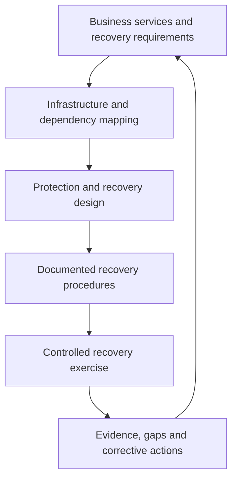

# Hybrid Infrastructure Disaster Recovery Playbook

A sanitized, platform-neutral playbook for planning, testing and governing disaster recovery across datacenter, virtualization, cloud, backup, storage and critical infrastructure services.

> This repository contains generic professional guidance only. It excludes client names, production addresses, credentials, customer data and proprietary configurations.

## Purpose

The playbook helps infrastructure teams move from having backups to maintaining a tested recovery capability. It brings together service ownership, dependency mapping, RTO/RPO targets, recovery sequencing, evidence collection, communications and improvement actions.

## Recovery Governance Model

## Core Recovery Domains

| Domain | Recovery Considerations |
|---|---|
| Identity and DNS | Authentication, directory services, name resolution and administrative access |
| Network and Security | Routing, firewalls, VPNs, load balancers, segmentation and secure connectivity |
| Compute and Virtualization | Hypervisors, clusters, hosts, templates and workload placement |
| Storage | SAN/NAS availability, replication, snapshots, capacity and performance |
| Backup and Recovery | Restore points, immutable copies, media, catalog protection and restore validation |
| Cloud and SaaS | Subscriptions, identity, private connectivity, policy, quotas and service dependencies |
| Applications and Databases | Recovery order, consistency, credentials, integrations and business validation |
| Monitoring and Operations | Alerting, logging, ticketing, escalation, evidence and handover |

## Recovery Lifecycle

1. Define critical services, owners and business impact.
2. Confirm RTO, RPO, retention and compliance requirements.
3. Map infrastructure and application dependencies.
4. Select recovery tiers and protection methods.
5. Document recovery sequencing and decision authority.
6. Prepare isolated or controlled recovery targets.
7. Execute technical and business validation.
8. Record evidence, timings, gaps and corrective actions.
9. Revalidate after major infrastructure or application changes.

## Test Scenarios

- File, folder and application-item recovery
- Virtual-machine and full-workload recovery
- Storage or backup-platform outage
- Primary-site or datacenter loss
- Identity, DNS or network dependency failure
- Cloud-region, subscription or connectivity disruption
- Cyber-recovery from an immutable copy
- Long-term archive retrieval
- Return to normal operations and protection reactivation

## Practical Templates

- [Disaster-Recovery Test Plan](docs/dr-test-plan-template.md)
- [Continuity Readiness Checklist](docs/continuity-readiness-checklist.md)
- [Recovery Evidence Register](docs/recovery-evidence-register.md)

## Success Criteria

A recovery exercise is complete only when:

- The required restore point is available and trusted.
- The workload or service starts successfully.
- Infrastructure and application dependencies are validated.
- Business owners confirm service usability.
- Actual RTO and RPO results are recorded.
- Monitoring and protection are restored.
- Evidence, gaps, owners and due dates are documented.
- Lessons learned are incorporated into the next test.

## Safe Use

Validate every procedure in a controlled environment and follow approved change, security and communication processes. Never publish completed recovery records containing internal addresses, credentials, confidential screenshots or customer information.

## License

This repository is available under the [MIT License](LICENSE).

## Author

**Sajid Sarwar**  
Senior IT Infrastructure & Cloud Engineer  
[LinkedIn](https://www.linkedin.com/in/sajidsarwarkwt/)
